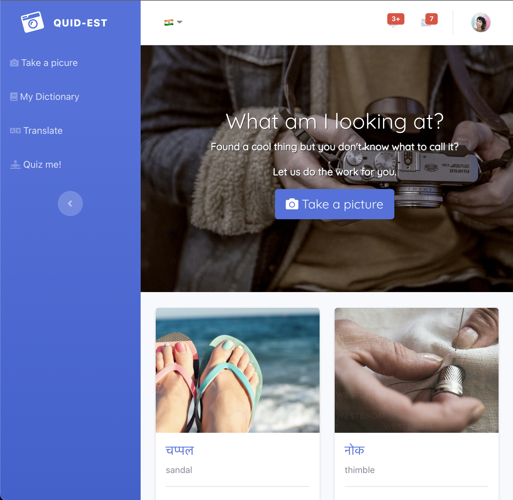

# Quid-Est?
Ever found something cool while travelling and didn't know what to call it? Take it's photo; this app will translate that 'thing' in your photo into the local language. 

## Stack
This project was initialized with [Create React App](https://github.com/facebook/create-react-app).

Styling and layout was done with [bootstrap](https://getbootstrap.com).

[Firebase](https://firebase.google.com/) was used for storing files/images, data/documents and for user authentication. 

[TensorflowJS](https://www.tensorflow.org/js/) model [MobileNet](https://github.com/tensorflow/tfjs-models/tree/master/mobilenet) was used for image analysis. 

[Google Translate API](https://cloud.google.com/translate) was used for translating text into the local language. 

## Setup
1. git clone this repo to your system
1. setup a project in your firebase console, and register a web app.
1. enable email/password login in firebase authentication for your project in firebase console. 
1. setup firebase firestore and storage in the firebase console. 
1. copy the firebase config of your project into your local .env file (use the template in .env.example file)
1. npm install -g firebase-tools && firebase login if using firebase for the first time on your system.
1. npm run build to build the react app
1. firebase deploy --only hosting to deploy the app to your firebase hosted domain. 

## Screenshots
### Dashboard

### Find out what to call it in the local language

### Choose from a variety of languages

### View your previous images & translations

### Dashboard
